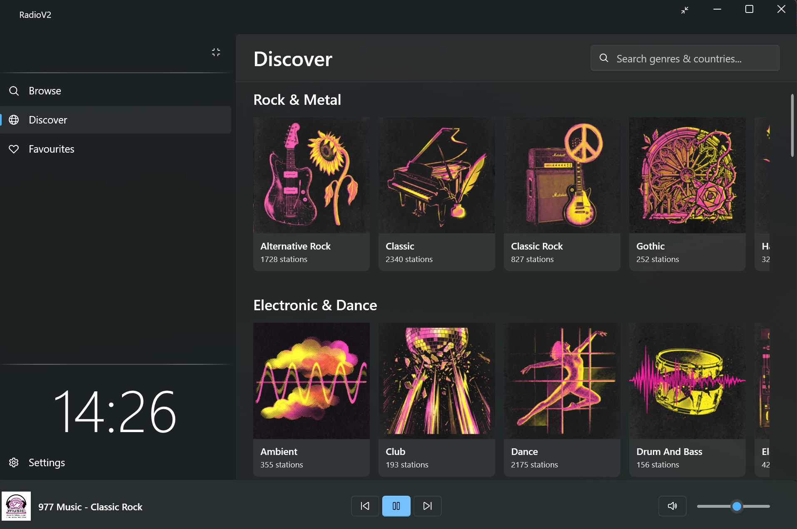
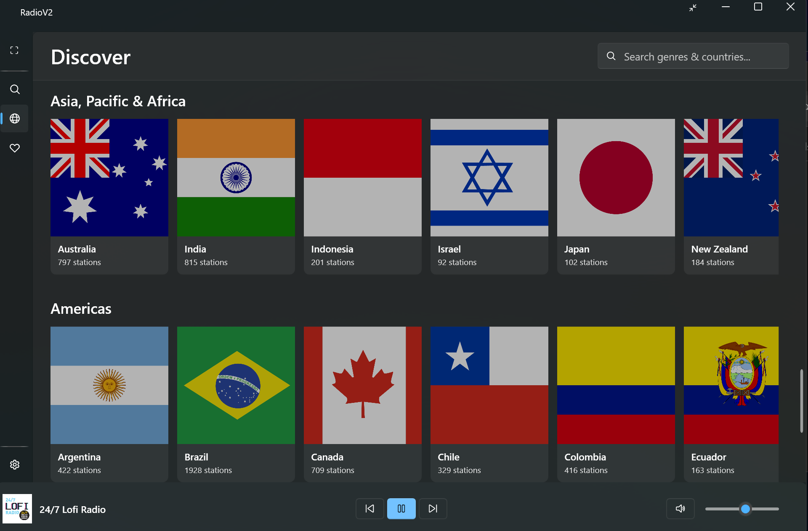
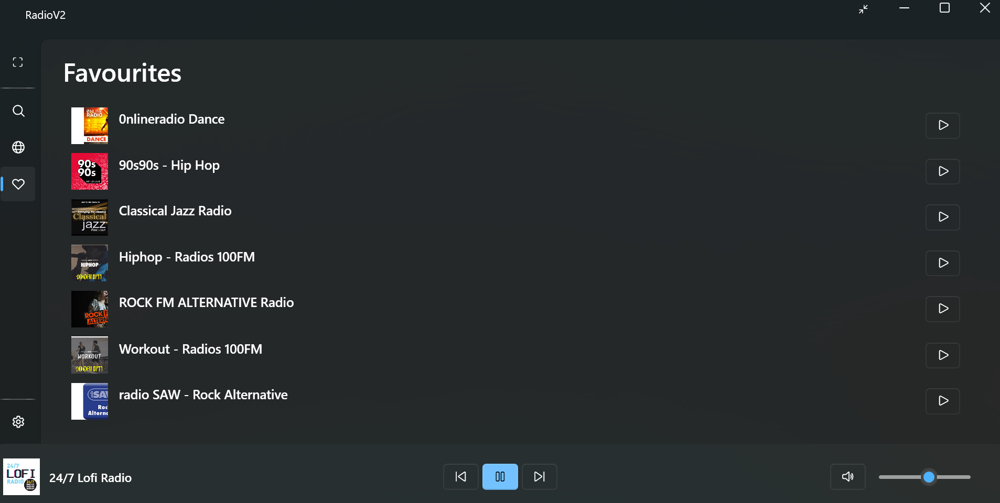

<p align="center">
  
</p>

<p align="center">
  <a href="https://github.com/Natboa/RadioV2/releases/tag/v1.0.2"></a>
  
  <a href="Legal/LICENSE"></a>
</p>

<h3 align="center">A modern Windows desktop internet radio player built with Fluent Design.</h3>

<table align="center">
  <tr>
    <td></td>
    <td></td>
    <td></td>
  </tr>
</table>

## Overview

RadioV2 is a lightweight desktop application for discovering, browsing, and streaming internet radio stations. It ships with a pre-seeded database of tens of thousands of stations organized by genre.

## Features

- Browse and search stations across dozens of genre groups
- Discover stations by category with infinite-scroll lists
- Save and manage favourite stations
- Import and export favourites in M3U/M3U8 and JSON formats
- Persistent mini-player bar with live now-playing metadata
- Global media key support (Play/Pause, Next, Previous, Stop)
- System tray integration — minimize to tray, restore on double-click
- Light and Dark theme support with Mica backdrop

## Installation

**Option 1 — Installer (recommended)**

Download and run the setup wizard:

👉 [RadioV2Setup.exe](https://github.com/Natboa/RadioV2/releases/download/v1.0.2/RadioV2Setup.exe)

**Option 2 — Build from source**

**Prerequisites:** .NET 8 SDK, Windows 10 or 11.

```bash
git clone https://github.com/Natboa/RadioV2.git
cd radioV2
dotnet build
dotnet run
```

## Tech Stack

| Layer | Technology |
|---|---|
| UI Framework | WPF + [WPF-UI](https://github.com/lepoco/wpfui) (Fluent Design 2) |
| Architecture | MVVM via `CommunityToolkit.Mvvm` |
| Audio Playback | LibVLCSharp + VideoLAN.LibVLC.Windows |
| Database | SQLite 3 via Entity Framework Core 8 |
| Target Framework | .NET 8 (Windows) |

## Project Structure

```
RadioV2/
├── Assets/             # Icons, logos, genre images, screenshots
├── Controls/           # StationListItem, MiniPlayer, SoundbarAnimation
├── Converters/         # WPF value converters (bool → icon, visibility, etc.)
├── Data/               # SQLite seed database (stations.db, gitignored)
├── Helpers/            # NowPlayingParser, ThemeHelper, MediaKeyHook, TrayIconManager
├── Installer/          # Inno Setup script (RadioV2Setup.iss)
├── Legal/              # LICENSE, DMCA policy
├── Models/             # Shared view models and UI-layer types
├── RadioV2.Core/       # Core library: EF Core entities, DbContexts (stations + user data)
├── Services/           # Playback, station data, favourites I/O, M3U import, logo cache
├── ViewModels/         # One ViewModel per page + MiniPlayer + MainWindow
└── Views/              # Browse, Discover, Favourites, Settings pages
```

## License

Distributed under the MIT License. See [LICENSE](Legal/LICENSE) for details.

## Legal

RadioV2 is an internet radio aggregator and does not host or rebroadcast audio content. All streams are provided by third-party radio stations and accessed directly by users.

For copyright concerns or DMCA takedown requests, see [DMCA.txt](Legal/DMCA.txt).
